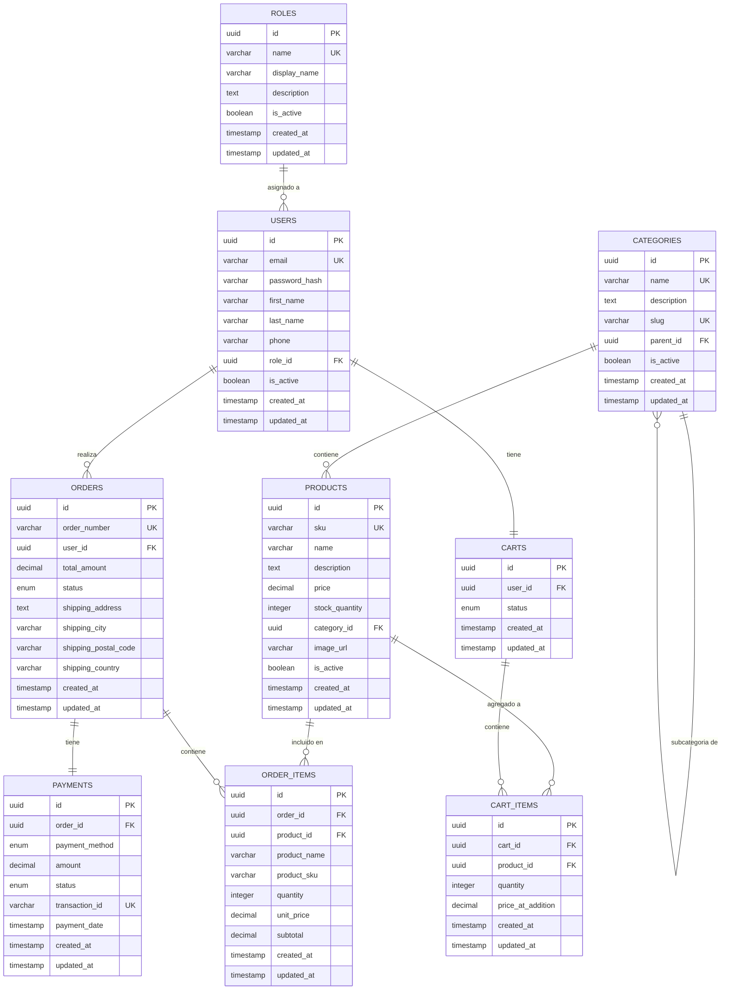

# 📊 Diagrama Entidad-Relación - DaviStore

## Diagrama Visual (Mermaid)

**Nota:** El sistema usa tabla `roles` en lugar de ENUM para máxima escalabilidad.



## Cardinalidades Detalladas

### 0️⃣ ROLES - USERS
- **Relación**: 1:N (Un rol puede tener múltiples usuarios)
- **Justificación**: Escalabilidad - agregar roles sin modificar schema
- **FK**: `users.role_id → roles.id`
- **On Delete**: `RESTRICT` (no se puede eliminar rol con usuarios asignados)
- **Ventajas**: 
  - Roles dinámicos sin ALTER TYPE
  - Metadatos adicionales (display_name, description)
  - Fácil agregar nuevos roles desde admin UI

### 1️⃣ USERS - CARTS
- **Relación**: 1:1 (Un usuario tiene UN carrito activo)
- **Justificación**: Simplifica la gestión del carrito
- **FK**: `carts.user_id → users.id`
- **Constraint**: `UNIQUE(user_id)` asegura un carrito por usuario

### 2️⃣ USERS - ORDERS
- **Relación**: 1:N (Un usuario puede tener múltiples órdenes)
- **Justificación**: Histórico de compras del usuario
- **FK**: `orders.user_id → users.id`
- **On Delete**: `RESTRICT` (no se puede eliminar usuario con órdenes)

### 3️⃣ CATEGORIES - CATEGORIES
- **Relación**: 1:N (Autoreferencia para jerarquía)
- **Justificación**: Categorías y subcategorías ilimitadas
- **FK**: `categories.parent_id → categories.id`
- **On Delete**: `SET NULL` (si se elimina padre, hijos quedan huérfanos)

### 4️⃣ CATEGORIES - PRODUCTS
- **Relación**: 1:N (Una categoría tiene muchos productos)
- **Justificación**: Organización del catálogo
- **FK**: `products.category_id → categories.id`
- **On Delete**: `RESTRICT` (no se puede eliminar categoría con productos)

### 5️⃣ CARTS - CART_ITEMS
- **Relación**: 1:N (Un carrito tiene múltiples items)
- **Justificación**: Múltiples productos en el carrito
- **FK**: `cart_items.cart_id → carts.id`
- **On Delete**: `CASCADE` (si se elimina carrito, se eliminan items)

### 6️⃣ PRODUCTS - CART_ITEMS
- **Relación**: 1:N (Un producto puede estar en múltiples carritos)
- **Justificación**: Múltiples usuarios pueden tener el mismo producto
- **FK**: `cart_items.product_id → products.id`
- **On Delete**: `RESTRICT` (no se puede eliminar producto en carritos activos)
- **Unique**: `(cart_id, product_id)` evita duplicados

### 7️⃣ ORDERS - ORDER_ITEMS
- **Relación**: 1:N (Una orden tiene múltiples items)
- **Justificación**: Múltiples productos por orden
- **FK**: `order_items.order_id → orders.id`
- **On Delete**: `RESTRICT` (integridad del histórico)

### 8️⃣ PRODUCTS - ORDER_ITEMS
- **Relación**: 1:N (Un producto puede estar en múltiples órdenes)
- **Justificación**: Histórico de ventas del producto
- **FK**: `order_items.product_id → products.id`
- **On Delete**: `RESTRICT` (preserva histórico)
- **Nota**: Se guardan snapshots (name, sku) para inmutabilidad

### 9️⃣ ORDERS - PAYMENTS
- **Relación**: 1:1 (Una orden tiene un pago)
- **Justificación**: Simplificación (un pago por orden)
- **FK**: `payments.order_id → orders.id`
- **Constraint**: `UNIQUE(order_id)`
- **Extensión futura**: Puede cambiarse a 1:N para pagos parciales

## Flujo de Datos Principal

### 🛒 Proceso de Compra

```
1. Usuario se registra/autentica
   └─> Se crea registro en USERS

2. Sistema crea carrito automáticamente
   └─> Se crea registro en CARTS (status: active)

3. Usuario navega productos
   └─> Consulta a PRODUCTS + CATEGORIES

4. Usuario agrega producto al carrito
   ├─> Se valida stock en PRODUCTS
   ├─> Se crea/actualiza registro en CART_ITEMS
   └─> Se guarda snapshot del precio (price_at_addition)

5. Usuario procede al checkout
   ├─> Se valida stock nuevamente
   ├─> Se genera order_number único
   ├─> Se crea registro en ORDERS
   ├─> Se copian items de CART_ITEMS a ORDER_ITEMS (con snapshots)
   ├─> Se actualiza stock en PRODUCTS (stock_quantity -= quantity)
   └─> Se marca carrito como completed (CARTS.status = 'completed')

6. Usuario realiza el pago
   ├─> Se crea registro en PAYMENTS (status: pending)
   ├─> Se procesa pago con proveedor externo
   ├─> Se actualiza PAYMENTS (status: approved, transaction_id)
   └─> Se actualiza ORDERS (status: processing)

7. Sistema procesa la orden
   ├─> Orden en preparación (status: processing)
   ├─> Orden enviada
   └─> Orden entregada (status: completed)
```

## Patrones de Integridad

### 🔒 Validaciones a Nivel de BD

| Tipo | Tabla | Campo | Validación |
|------|-------|-------|------------|
| CHECK | products | price | `> 0` |
| CHECK | products | stock_quantity | `>= 0` |
| CHECK | cart_items | quantity | `> 0` |
| CHECK | order_items | quantity | `> 0` |
| CHECK | users | email | Formato email válido |
| CHECK | categories | slug | Solo lowercase y guiones |
| UNIQUE | users | email | Sin duplicados |
| UNIQUE | products | sku | Sin duplicados |
| UNIQUE | cart_items | (cart_id, product_id) | Un producto por carrito |
| UNIQUE | carts | user_id | Un carrito por usuario |

### 🔗 Estrategias de DELETE

| Relación | Estrategia | Justificación |
|----------|-----------|---------------|
| users ← carts | CASCADE | Si se elimina usuario, eliminar carrito temporal |
| carts ← cart_items | CASCADE | Si se elimina carrito, eliminar items |
| users ← orders | RESTRICT | Preservar histórico de órdenes |
| orders ← order_items | RESTRICT | Preservar histórico completo |
| orders ← payments | RESTRICT | Preservar registros contables |
| products ← cart_items | RESTRICT | Evitar inconsistencias en carritos activos |
| products ← order_items | RESTRICT | Preservar histórico de ventas |
| categories ← products | RESTRICT | Evitar productos huérfanos |
| categories ← categories | SET NULL | Categoría padre eliminada → hijos sin padre |

### 📸 Snapshot Pattern (Inmutabilidad)

Se aplica snapshot en:

1. **cart_items.price_at_addition**
   - Preserva el precio cuando se agregó al carrito
   - Evita cambios si el precio del producto cambia

2. **order_items (product_name, product_sku, unit_price)**
   - Preserva información del producto en el momento de la compra
   - Histórico inmutable aunque el producto cambie o se elimine

3. **orders (shipping_address, shipping_city, etc.)**
   - Preserva dirección de envío en el momento de la orden
   - Histórico inmutable aunque el usuario cambie su dirección

**Trade-off**: Se sacrifica normalización (DRY) por inmutabilidad y confiabilidad del histórico.

## Índices y Performance

### Índices Simples
```sql
-- Búsquedas frecuentes por clave única
idx_users_email (users.email)
idx_products_sku (products.sku)
idx_orders_number (orders.order_number)

-- Búsquedas por foreign keys
idx_products_category (products.category_id)
idx_orders_user (orders.user_id)
idx_cart_items_cart (cart_items.cart_id)
idx_order_items_order (order_items.order_id)

-- Filtros comunes
idx_products_active (products.is_active)
idx_orders_status (orders.status)
```

### Índices Compuestos
```sql
-- Consultas que combinan múltiples filtros
idx_products_category_active (products.category_id, products.is_active)
idx_orders_user_status (orders.user_id, orders.status)
```

**Impacto**: 
- ✅ Mejora velocidad de consultas SELECT
- ⚠️ Pequeño impacto en INSERT/UPDATE
- 💡 Trade-off justificado: más lecturas que escrituras en e-commerce

## Escalabilidad Futura

### Posibles Extensiones

1. **Múltiples direcciones por usuario**
   ```
   Tabla: user_addresses
   - Separar direcciones en tabla independiente
   - Marcar una como predeterminada
   ```

2. **Sistema de reviews**
   ```
   Tabla: product_reviews
   - FK a users y products
   - Rating, comentario, fecha
   ```

3. **Sistema de cupones/descuentos**
   ```
   Tabla: coupons, order_coupons
   - Códigos promocionales
   - Descuentos aplicados por orden
   ```

4. **Wishlist (lista de deseos)**
   ```
   Tabla: wishlists, wishlist_items
   - Similar a carts pero sin checkout
   ```

5. **Notificaciones**
   ```
   Tabla: notifications
   - Alertas de stock, ofertas, estado de orden
   ```

6. **Audit logs completos**
   ```
   Tabla: audit_logs
   - Registro de todos los cambios críticos
   - Quién, qué, cuándo
   ```

7. **Múltiples imágenes por producto**
   ```
   Tabla: product_images
   - FK a products
   - Orden de visualización
   ```

8. **Variantes de producto**
   ```
   Tabla: product_variants
   - Color, talla, etc.
   - Stock por variante
   ```

Todas estas extensiones son compatibles con el diseño actual sin necesidad de refactorizar.

